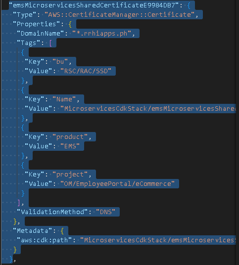
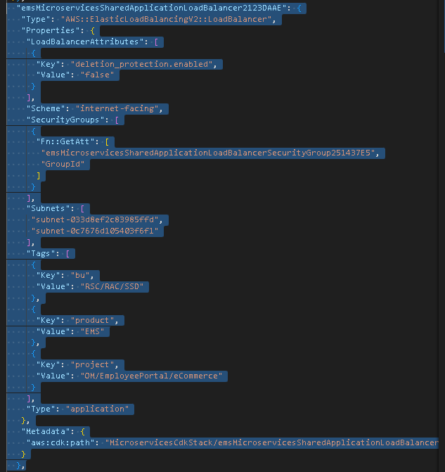
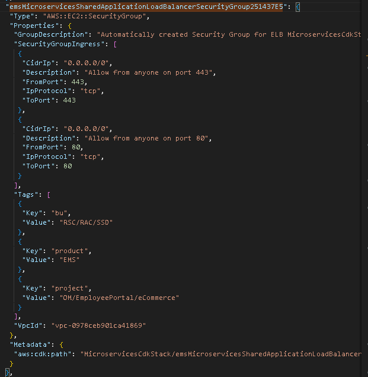
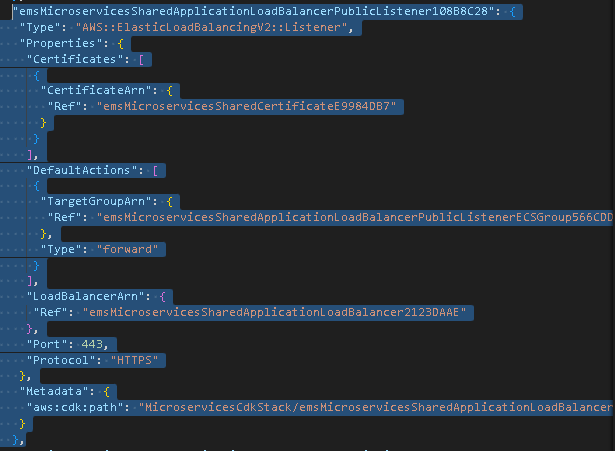
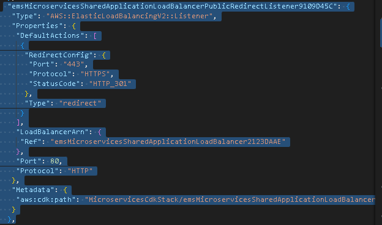
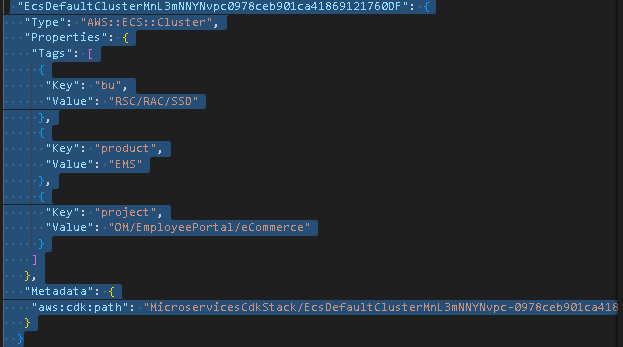
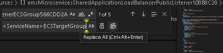
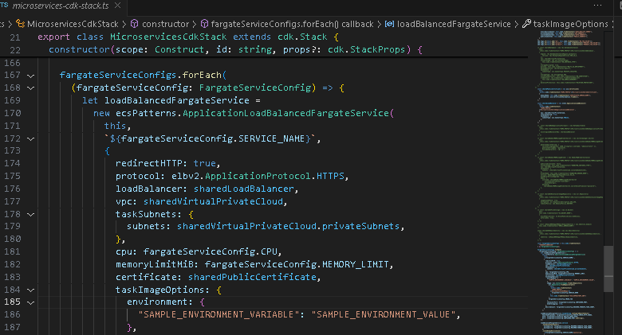

# ECS Fargate Mnecessary if provisioning the RabbitMQ via CloudFormation, name of the Amazon MQ Rabbit MQ message broker instance

`AWS_REGION`| AWS region where the VPC is in

`AWS_ACCOUNT_ID`| AWS Account ID where to deploy the resources related to this microservice deployment

`DB_IDENTIFIER`| Optional, name of the RDS Database to be provisioned via CloudFormation

`DB_INSTANCE_TYPE`| CloudFormation, Instance type and size of the RDS database to be provisioned

`MULTI_AZ_DEPLOYMENT`| whether the RDS Database is deployed in two availability zone for high-availability

`DATA_SUBNETS`| subnets to be used to deploy the RDS Database and MQ Message Broker

`APP_SUBNETS`| subnets, usually private subnets to deploy this ecs fargate microservices

`PUBLIC_SUBNETS` | public subnets where to deploy the load balancer in

`CERTIFICATE_DOMAIN_NAME`| domain name where SSL/TLS certificates to be requested to enable HTTPS traffic

`RABBITMQ_INSTANCE_TYPE` | optional, instance type and size of MQ MessageBroker instance\

`S3_BUCKET_NAME` | optional, s3 bucket to be provisioned with autogenerated name for file storage

`EMAIL_DOMAIN_NAME` | optional, SES Email domain to be created for SES email sending

`DB_ADMIN_USERNAME` | optional, admin username for RDS Database

Once you fill the Context variables, run:
`cdk synth`   emits the synthesized CloudFormation template

If you are deploying the ECS Fargate microservice in an existing load balancer, you must do the modifications and configurations on the `cdk.out/MicroservicesCdkStack.template.json

delete the resource of Type "AWS::CertificateManager::Certificate"

delete the resource of type "AWS::ElasticLoadBalancingV2::LoadBalancer"

delete the resource with the name of "emsMicroservicesSharedApplicationLoadBalancerSecurityGroup251437E5" or has a string of SharedApplicationLoadBalancerSecurityGroup"

delete all resources (2 resources) of type "AWS::ElasticLoadBalancingV2::Listener"

delete resource of type ""AWS::ECS::Cluster""

Replace ALL words that is emsMicroservicesSharedApplicationLoadBalancerPublicListenerECSGroup566CDD2A to <NamePrefix><ServiceName>ECSTargetGroup

Once completed, you append the resources onto the existing cloudformation template for provisioningwork for defining cloud infrastructure in a programming language such as TypeScript or C#/.Net and provisioning it through AWS Cloud

## Deployment
When you're ready to deploy your awesome app, here are some important things to do before deploying your on ECS using this CDK script

You can define environment variables through the `environment` property under `taskImageOptions` object for  the specific ECS Fargate microservice on `lib/microservices-cdk-stack.ts`

Update `cdk.json` specifically the following key-value pairs contained in `context`:

* `BU_TAG_VALUE`| value of bu tag

* `PROJECT_TAG_VALUE`| value of project tag

* `PRODUCT_TAG_VALUE`| value of product tag

* `FARGATE_SERVICES`| configuration for a specific ECS Fargate microservice

* `SERVICE_NAME`| Name of the ECS Fargate microservice

`CPU`| The number of cpu units used by the task. for more details on the valid values see [ECS Task definition parameters](https://docs.aws.amazon.com/AmazonECS/latest/developerguide/task_definition_parameters.html#task_size)

`MEMORY_LIMIT`| The amount (in MiB) of memory used by the task. for more details on the valid values see [ECS Task definition parameters](https://docs.aws.amazon.com/AmazonECS/latest/developerguide/task_definition_parameters.html#task_size)

`CONTAINER_PORT`| The port number on the container that is bound to the user-specified or automatically assigned host port.

`IMAGE_TAG`| The tag of the contaimer that ECS would pull from to deploym your awesome app

`DESIRED_FARGATE_TASK_COUNT` | the ideal number of tasks ECS should work on scaling this specific microservice

`MINIMUM_FARGATE_TASK_COUNT`| the minimum number of task ECS can host provision at all times

`MAXIMUM_FARGATE_TASK_COUNT` | the maximum number of tasks ECS can provision at all times

`TARGET_CPU_UTILIZATION_PERCENT` | the CPU Utilization percentage treshold ECS uses to determine whether it would scale out(provision another tasks) or scale in(decomission or delete task) for this specific microservice

`REQUEST_PRIORITY`| **Important** must be unique among other microservices that are deployed, from 1-50000, rules are evaluated in priority order, from the lowest value to the highest value

`PATH_PATTERNS`| the path pattern that this microservices is expected to handle or receive

`HEALTH_CHECK_HTTP_CODES` | the expected http code loadbalancer expectes when checking if the microservice is ready to handle traffic

`HEALTH_CHECK_PATH` | the path that the load balancer sends request to to perform health check

`NAME_PREFIX`| Prefix used for naming resources related to this microservice deployment

`ECR_REPOSITORY_ARN` | Amazon Resource Name identifier of the Elastic Container Repository that the ECS would pull the contaimer image for this deployment

`VPC_IDENTIFIER` | ID of the Virtual Private Cloud used for this microservice deployment

`RABBITMQ_BROKER_NAME`| Optional, only necessary if provisioning the RabbitMQ via CloudFormation, name of the Amazon MQ Rabbit MQ message broker instance

`AWS_REGION`| AWS region where the VPC is in

`AWS_ACCOUNT_ID`| AWS Account ID where to deploy the resources related to this microservice deployment

`DB_IDENTIFIER`| Optional, name of the RDS Database to be provisioned via CloudFormation

`DB_INSTANCE_TYPE`| CloudFormation, Instance type and size of the RDS database to be provisioned

`MULTI_AZ_DEPLOYMENT`| whether the RDS Database is deployed in two availability zone for high-availability

`DATA_SUBNETS`| subnets to be used to deploy the RDS Database and MQ Message Broker

`APP_SUBNETS`| subnets, usually private subnets to deploy this ecs fargate microservices

`PUBLIC_SUBNETS` | public subnets where to deploy the load balancer in

`CERTIFICATE_DOMAIN_NAME`| domain name where SSL/TLS certificates to be requested to enable HTTPS traffic

`RABBITMQ_INSTANCE_TYPE` | optional, instance type and size of MQ MessageBroker instance\

`S3_BUCKET_NAME` | optional, s3 bucket to be provisioned with autogenerated name for file storage

`EMAIL_DOMAIN_NAME` | optional, SES Email domain to be created for SES email sending

`DB_ADMIN_USERNAME` | optional, admin username for RDS Database

Once you fill the Context variables, run:
`cdk synth`   emits the synthesized CloudFormation template

If you are deploying the ECS Fargate microservice in an existing load balancer, you must do the modifications and configurations on the `cdk.out/MicroservicesCdkStack.template.json

delete the resource of Type "AWS::CertificateManager::Certificate"

delete the resource of type "AWS::ElasticLoadBalancingV2::LoadBalancer"

delete the resource with the name of "emsMicroservicesSharedApplicationLoadBalancerSecurityGroup251437E5" or has a string of SharedApplicationLoadBalancerSecurityGroup"

delete all resources (2 resources) of type "AWS::ElasticLoadBalancingV2::Listener"

delete resource of type ""AWS::ECS::Cluster""

Replace ALL words that is emsMicroservicesSharedApplicationLoadBalancerPublicListenerECSGroup566CDD2A to 

(NamePrefix)(ServiceName)ECSTargetGroup

Once completed, you append the resources onto the existing cloudformation template for provisioning
